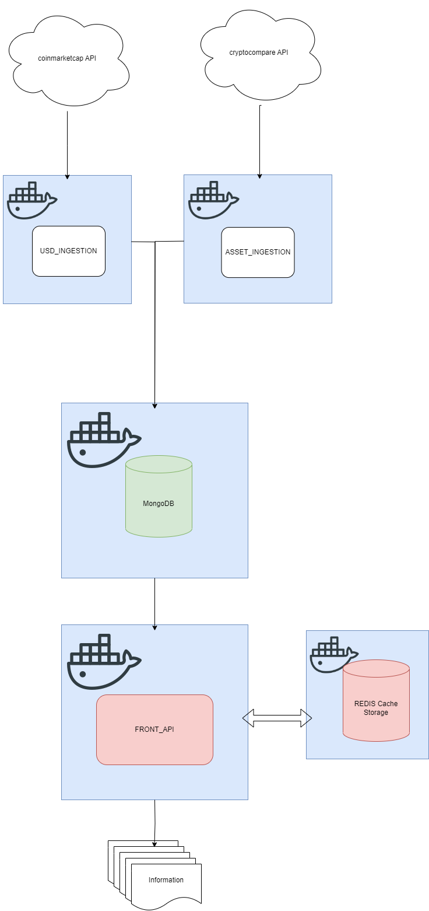

# Introduction
This project comes to create an example of API Ingestion, MongoDB use in Python and how to handle all this information with FastAPI in a dockerized environment. To achieve this goal I have created dockerized services that connect between themselves using MongoDB as the core of the information.
# How to run it
In the project, there is a folder called **docker**, in this folder there are all the configuration files needed to run everything, but the most important one is the **launch_script.sh**. This script has all the needed commands to get everything up and runnning and also doing a first ingestion.
```
bash ./docker/launch_script.sh
```
Inside it we can see that it builds all docker images before running them and launches tests and dependencies for their images:

1. Kills everything in docker
2. Runs MongoDB in detached mode with a MongoExpress module to check Mongo
3. Builds and runs both ingestion modules
4. Runs fresh Redis cache container
5. Runs API front

## Usefull URLs
- **MongoExpress:** http://localhost:8081/
- **FrontAPI Swagger docs:** http://localhost:5001/docs
- **FrontAPI Sample call:** http://localhost:5001/?limit=50

# Extra information
## ARCHITECTURE 
To give a better understanding of the whole project, here is a diagram:
<p align="center">
  
<p>
The focus was to create something very similar to the real architecture that was being used at the enterprise, so as to show better knowledge of known technologies. The use of MongoDB as the core of the information comes to fulfill that statement. I have made two different docker containers for both API ingestion and those connect to MongoDB separately and inform 2 different tables, as if we were reading information (which we actually are) from 2 different sources with different times of refresh. Doing this we simulate better a multi service architecture.

Finally we got the FRONT_API which will be our door to the world and the only part of our project that can receive external requests. There is also a REDIS container attatched to this one to handle cache of requests, allowing to reduce MongoDB calls in cases of numerous calls with the same information required.

## PERFORMANCE
### INGESTION IMPROVEMENTS
After taking into consideration the need to make inserts much faster and with the request that this should have good scalability and also bring the thought of handling much more data, I have researched for better options to handle MongoDB inserts without using the simple ***insert_many()***.

First of all, we have implemented a pool for Mongo, this allows us to use more than one instance of a client at concurrency, which allows to make multiple inserts at the same time. Apart from that I have made python pool equivalent to the cpu number to being able to launch a pool in each of my cpu cores. Once everything is set, I set a chunksize to efficiently divide the list in parts and being able to insert each register having all pools running with data.

I have used this documentation as a reference for a good practice:
- [MongoDB Facts: 80000+ inserts/second on commodity hardware](https://vladmihalcea.com/mongodb-facts-80000-insertssecond-on-commodity-hardware/) 
- [PyMongo: Pooling](https://pymongo.readthedocs.io/en/stable/faq.html#how-does-connection-pooling-work-in-pymongo)
- [The efficient way of using multiprocessing with pymongo](https://saksham-malhotra2196.medium.com/the-efficient-way-of-using-multiprocessing-with-pymongo-a7f1cf72b5b7)

This procedure has been applied to both ingestion modules.
### API FRONT IMPROVEMENTS

I have been researching about how to maximize MongoDB's performance when doing data extraction. And also I have implemented cache, which can be achieved with ***Redis*** and ***fast-api-cache2***, which is the best option and the cleanest I have found. Redis is common in all the examples I have seen and it works perfectly with this library, providing a very clean set of properties that can be quite scalable for future endpoint features.

We have also worked improving the way we are going to use the data from MongoDB adding an index to ***symbol*** in **USD_values** as it is the table from which we are going to be doing the "join" into **assets** . With this index we are making queries much more efficient and also we are going to make the joins doing unique queries using that index (which is a common value with **assets** and also is the only one that can be a match for sure), for this we are emulating the same thing done previously in the ingestion and we are going to use pooling for doing queries in concurrence to retrieve the values and set them in the format we want. Note that the order is being considered for the assets list, as [map function](https://docs.python.org/dev/library/multiprocessing.html#multiprocessing.pool.Pool.map) returns data ordered.


Note: Maybe there is another field to match both tables, but I lack the functional knowledge as the ids provided seem not related with the coin.

Finally, I have developed a method that uses **status** information to wait for the data to be ingested. I have created a timestamp marker in 2 collections status and status_assets which are deleted when starting ingestion and added again after that. That way we can check when retrieving the information if the process is finished and also when the information was last updated.

### ABOUT API REQUEST PAGINATION

I have checked both APIs docs to see if pagination was available, but as these examples are very small, they do not provide pagination, so then improvements in performance have been only on our side.  

I have not implemented the pagination for the result, as we are already giving the option to limit the results. This could be performed if needed, but I did not want to give a different format thant the one asked in the PDF.

## POSSIBLE IMPROVEMENTS TO CURRENT PROJECT

During the development of this test, there has been several out of scope ideas that could be also implemented to give extra value to this project:
-  Orchestration with Airflow in a container that runs every 10 min or so a docker-compose up of those containers that ingest data into MongoDB.
- Using examples with more data and with pagination available.
- Acceptance tests ( but they would need some functional validation ).
- More API calls, even some possibilities to edit data in MongoDB.

## BIBLIOGRAPHY

- [FastAPI Documentation](https://www.mongodb.com/developer/languages/python/python-quickstart-fastapi/)
- [StackOverflow](https://stackoverflow.com/)
- [MongoDB Facts: 80000+ inserts/second on commodity hardware](https://vladmihalcea.com/mongodb-facts-80000-insertssecond-on-commodity-hardware/) 
- [PyMongo: Pooling](https://pymongo.readthedocs.io/en/stable/faq.html#how-does-connection-pooling-work-in-pymongo)
- [The efficient way of using multiprocessing with pymongo](https://saksham-malhotra2196.medium.com/the-efficient-way-of-using-multiprocessing-with-pymongo-a7f1cf72b5b7)
- [Coinmarket](https://coinmarketcap.com/api/documentation/v1/#operation/getV1CryptocurrencyListingsLatest)
- [CryptoCompare](https://min-api.cryptocompare.com/documentation)
- [Securing Sensitive Data in Python: Best Practices for Storing API Keys and Credentials
](https://systemweakness.com/securing-sensitive-data-in-python-best-practices-for-storing-api-keys-and-credentials-2bee9ede57ee)
- [FatAPI in Docker Youtube Simple Tutorial](https://www.youtube.com/watch?v=EJ2djjnfXPc)
- [FastAPI Docker Oficial](https://fastapi.tiangolo.com/deployment/docker/)
- [Python Pooling](https://docs.python.org/dev/library/multiprocessing.html#multiprocessing.pool.Pool.map)
- [FastAPI Testing](https://fastapi.tiangolo.com/deployment/docker/)
- [FatAPI Cache Docs](https://github.com/long2ice/fastapi-cache/blob/main/tests/test_decorator.py)